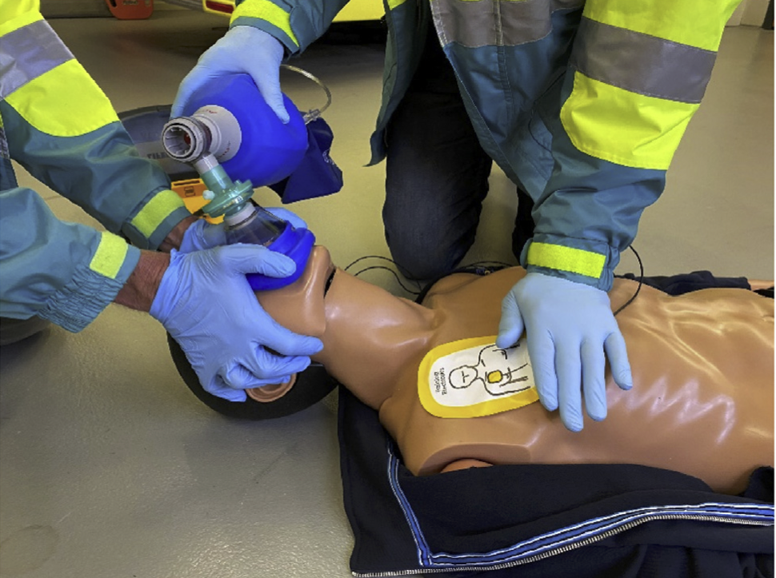

--- 
title: "First Aid Notes"
author: "PGS"
date: "`r Sys.Date()`"
header-includes:
  - \usepackage[default]{sourcesanspro}
  - \usepackage[T1]{fontenc}
  - \usepackage{geometry}
  - \geometry{top=1.5cm,bottom=2cm,lmargin=4cm,rmargin=4cm}
mainfont: SourceSansPro
output:
  pdf_document:
    toc: true
    toc_depth: 4
  html_document:
    toc: true
    toc_depth: '4'
    keep_md: true
    df_print: paged
--- 


```{r setup, include = FALSE}

knitr::opts_chunk$set(echo = FALSE, dev = "cairo_pdf")

```


```{r echo = F, eval = T, message = F}

library(knitr, dplyr)

library(kableExtra)

```


```{r}

colourise <- function(x, color) {
  if (knitr::is_latex_output()) {
    sprintf("\\textcolor{%s}{%s}", color, x)
  } else if (knitr::is_html_output()) {
    sprintf("<span style='color: %s;'>%s</span>", color,
      x)
  } else x
}

## Example of inline use: `r colourise("some words in red", "red")`

```


# Shock

Any medical condition or injury can lead to shock. Shock is brought on by low circulating blood volume. Patient will have lowered blood pressure.

**Signs and symptoms**

\vspace{-0.2cm}

- *Initial signs*

  - pale face, lips or fingernails
  - feeling faint or dizzy
  - cool, moist, sweaty skin
  - nausea
  - anxiety

- *Severe shock:*

  - feeling agitated
  - feeling thirsty
  - weak, rapid pulse
  - shallow, fast breathing
  - capillary refill more than 2 sec
  - blue face, earlobes, lips or fingernails (patient is very sick!)
  - decreasing level of consciousness

**Treatment**

\vspace{-0.2cm}

- DRSABCD
- Help the patient lie down. Do not raise their legs.
- Reassure them.
- Manage severe bleeding, if any, then other injuries.
- Loosen tight clothing.
- Keep them warm using a blanket.
- Give them small amounts of cool water (if they're conscious, don't have abdominal injuries and won't need an operation soon).
- If they have difficulty breathing, put them in the recovery position.

<br>

# Heat-induced illness

The aim is to cool down and rehydrate the patient.

*If they don't improve within 10 minutes, call an ambulance.*

<br>

**Signs and symptoms**

\vspace{-0.2cm}

- patient is hot, breathless and sweaty (or dry - worse!)
- they can't continue their activity - they feel too weak
- high body temperature
- feeling faint or dizzy
- nausea, vomiting or diarrhoea
- pale skin and signs of shock setting in
- weak, rapid pulse
- feeling unsteady on their feet
- decreasing level of consciousness

**Treatment**

\vspace{-0.2cm}

- Help patient to lie down in a cool, shaded area.
- Remove as much of their clothing as possible.
- Soak them with water.
- Apply ice packs to neck, armpits, groin.
- Fan them continuously.
- Keep spraying them with water or wiping them with a wet cloth.

<br>

# Swelling and cramps

Hot conditions may result in the body becoming temporarily overheated. This can lead to heat-induced swelling of hands or feet.

Losing too much water and salt through sweating can cause heat cramps, especially in the legs and abdomen.

<br>

**Treatment**

*Swelling*

\vspace{-0.2cm}

- Raise the affected limb.
- Get the patient to exercise it.
- Keep them cool.

*Cramps*

\vspace{-0.2cm}

- Get the patient to stop and rest.
- Gently stretch the muscle that's affected.
- Massage the muscle if it helps reduce pain.
- Apply a cold pack.
- Get the patient to drink some water.

<br>

# Crush injuries

Remove the source of crushing, *if it is safe to do so.*

- For example, if a victim is unconscious with bookshelves crushing their legs, which are bleeding, remove the bookshelves, if it's safe to do so.

When removing an object which is crushing a victim, be prepared to manage bleeding.

If there's lots of damage to the chest and/or abdomen, don't remove the crushing object.

Look at the CPD recording by Dr Jason Bendall on crush injuries (see Resources below).

<br>


# Wounds and Dressings

## Tourniquets

- Apply a tourniquet to the *upper* arm or *upper* leg only. A tourniquet needs to be applied over a single bone to be able to get the pressure needed to squeeze the blood vessel enough to stop blood flow. In lower limbs, there are two bones and you can never get enough pressure applied on the blood vessel.
- Write the time the tourniquet was applied on the patient's forehead in blood (the best ink!).

## Wound types

```{r}

wounds <- read.csv("wound_types.csv")

#knitr::kable(wounds)

wounds %>%
  kbl() %>%
  kable_styling(position = "left", full_width = F) %>%
  column_spec(2, width = "20em") %>%
  column_spec(3, width = "10em")

```

<br>

## Dressings

Dressings can

- absorb blood and other fluids
- keep a wound clean
- help protect a wound from infection
- protect a wound from bumps and scrapes
- reduce pain

### What dressings to use

*Dry dressings*

\vspace{-0.2cm}

- cuts and lacerations
- closed blisters (with no skin loss)
- punctures

*Moist (non-adherent) dressings*

\vspace{-0.2cm}

- grazes and abrasions
- open blisters (with skin loss)
- skin tears
- burns

*Adhesive dressings*

\vspace{-0.2cm}

- minor wounds

*Combine dressing*

\vspace{-0.2cm}

- large or deep wounds

<br>

# Alcohol and drugs

Users' own reports about their drug use are unreliable!

*Record what they say, treat what you find!*

## Broad groups

### Substances that slow people down - depressants

Depressants slow down messages travelling between the brain and the body.

**Signs and symptoms**

\vspace{-0.2cm}

- reduced pulse rate
- reduced blood pressure
- reduced level of consciousness
- usually also reduced respiration rate and respiration volume
- this general reduction in vital signs leads to reduced movement, resulting in *reduced temperature*

**Treatment**

\vspace{-0.2cm}

- Maintain the patient's airway and ventilation (usually with a bag valve mask (BVM) resuscitator - picture below).


```{r echo = F, out.width = "50%", fig.align = "left", fig.cap = "Bag-valve-mask (BVM) resuscitator"}

knitr::include_graphics("figs/bag_valve_mask_resuscitator_copy.png")

```

<br>

**Examples**

\vspace{-0.2cm}

- alcohol
- cannabis
- barbiturates (and other sleeping tablets)
- benzodiazepines (and other tranquilisers)
- narcotics (e.g. heroin)
- GHB (gamma hydroxybutyrate)
- volatile substances (e.g. petrol, thinners)
- amyl nitrite (inhalant; has been used to treat angina; *vasodilator* - medicine causing blood vessels to dilate, lowering blood pressure)

#### Alcohol - snippets

- Being drunk slows down the brain's ability to trigger a gag reflex, which prevents choking, so a drunk person may inhale vomit into their lungs.
- Keep them as upright as possible - never lay them down. If they can't sit up, put them into the recovery position.
- Alcohol is a diuretic. It also causes the stomach to produce more acid than usual, which may cause stomach ache, diarrhoea or vomiting. Give them an open bottle of water so they can *sip* when they want or rinse out their mouth - don't give them acidic drinks like fruit juice.
- Alcohol can cause a drop in body temperature, so keep them warm if they're cold.
- Don't leave them alone - particularly if they're vomiting. Monitor them.

**Effects of alcohol include:**

\vspace{-0.2cm}

- unsteady on feet
- dizziness
- slurred speech
- blurred vision
- reduced pulse
- reduced blood pressure
- reduced respiration rate and respiration volume
- reduced temperature
- slowed reaction time
- altered state of consciousness
- nausea and vomiting
- increased urination (diuretic effect)


### Substances that speed people up - stimulants

Stimulants speed up messages travelling between the brain and the body.

**Signs and symptoms**

\vspace{-0.2cm}

- increased pulse rate
- increased blood pressure
- increased level of consciousness
- usually also increased respiratory rate and respiratory volume
- this general increase in vital signs leads to increased movement, resulting in *increased temperature*
- sweating
- patient may be confused and unable to answer simple questions

**Treatment**

\vspace{-0.2cm}

- Reduce stimuli affecting the patient (i.e. move them away from loud music to a quiet place with no bright lights) to help *bring their temperature down* into the normal range (reducing stimuli and agitation is always the most effective way to reduce temperature).
- To reduce temperature, you may also need to
  - give them small amounts of water - give them an open bottle and say, "Sip when you need to"
  - remove clothing
  - keep the environment cool
- Stay with them - don't leave them alone - and monitor them.  

\vspace{2cm}

**Examples**

\vspace{-0.2cm}

- amphetamines and methamphetamines (crystal meth or ice, which comes in small crystals, is stronger and has more harmful side effects than the powdered form of methamphetamine or speed)
- cocaine
- ecstasy (i.e. MDMA or methylenedioxymethamphetamine - similar structure to methamphetamine (speed))

**Notes**

\vspace{-0.2cm}

- Crystal meth or ice, which comes in small crystals, is stronger and has more harmful side effects than the powdered form of methamphetamine or speed.
- The effect of stimulants is similar to a state of fright. Blood moves to the muscles to prepare for running away, pupils dilate so the person can see better. Maintaining this state of fright requires energy - the body uses up available energy stores (glucose) and *body temperature increases*.
- MDMA affects how the body regulates temperature and the body may not respond to warning signals from the brain about it overheating, so the person may not realise their body temperature is becoming too high.

### Other types of drug

- **Dissociative drugs**

  - ketamine
  
    - makes people feel separated from their body or environment, producing symptoms such as:
    - feeling relaxed
    - hallucinations
    - confusion and clumsiness
    - slurred speech and blurred vision
    - increased heart rate and blood pressure
    - vomiting

<br>

# Heart conditions and chest pain

First, some terminology ...

**Angina (or ischaemic chest pain)**

\vspace{-0.2cm}

- temporary pain or discomfort in the chest usually brought on by exercise or emotional stress because the coronary arteries are too narrow to supply the extra oxygenated blood required by the increased stress

**Chronic heart failure**

\vspace{-0.2cm}

- an ongoing condition, where the heart muscle is weak and cannot pump normally, often because of age, chronic heart disease or a previous heart attack

**Heart attack**

\vspace{-0.2cm}

- occurs when there's a blockage in an artery supplying blood to some part of the heart, preventing blood from reaching the heart muscle beyond the blockage and leading to damage to the heart muscle
- symptoms can appear suddenly but more often start slowly and persist for hours, days or weeks
- the heart usually keeps pumping during a heart attack
- heart attack *can* bring on cardiac arrest

**Cardiac arrest**

\vspace{-0.2cm}

- an electrical malfunction of the heart that causes the ventricles (large pumping chambers) to quiver or "fibrillate" erratically so that the heart cannot pump blood around the body effectively
- when pumping is disrupted, the heart cannot supply blood to the brain, lungs or other organs and the patient loses consciousness and has no pulse
- there is often no warning or symptoms before the patient collapses

*Note the difference between heart attack and cardiac arrest.*

<br>

\vspace{0.2cm}

**`r colourise("NBB", "purple")`**

\vspace{-0.2cm}

- `r colourise("If chest pain comes on quickly or is severe, it's likely to be a heart attack. Call 000.", "purple")`
- `r colourise("If the patient has angina tablets, it's likely to be angina. Help patient take their angina tablets.", "purple")`


## Chronic heart failure

**Signs and symptoms**

\vspace{-0.2cm}

- general tiredness
- breathlessness when exercising or lying down
- coughing and wheezing
- swollen feet, ankles, legs and abdomen

**Treatment**

\vspace{-0.2cm}

- Unconscious patient
  - DRSABCD
  - call 000

- Conscious patient
  - help patient sit or lie in a comfortable position and reassure them
  - loosen any tight clothing
  - if the patient becomes breathless or collapses, follow DRSABCD and call 000
  
 
## Angina

- angina is usually relieved by rest and angina medication
- most patients with angina are aware of it and have angina medication

**Signs and symptoms**

\vspace{-0.2cm}

- discomfort or tight or squeezing pain in the chest (usually in the centre)
- pain may be mild to severe
- pain may spread from chest to jaw, neck, back, one or both shoulders, arms or hands **or** be in any of those other places rather than in the chest
- shortness of breath

*If the patient has the above symptoms and they aren't relieved by angina medication, treat the patient as for a heart attack.*

\vspace{0.4cm}

**Treatment**

\vspace{-0.2cm}

- ask patient to stop what they're doing and rest
- help them sit or lie in a comfortable position and reassure them
- loosen any tight clothing
- ask them to describe their symptoms
- ask if these signs or symptoms have happened before
  - if so, ask if they have any medication for them
- if rest does not relieve symptoms
  - help them take their angina medication
  - if angina medication has not relieved symptoms after 5 minutes, get them to take another dose
- if symptoms are severe or have not been relieved after 10 minutes, call 000
- operator at 000 may recommend giving patient 300 mg aspirin, if patient can tolerate aspirin
- stay with the patient - do not drive them to hospital, in case you need to do CPR
- if symptoms are relieved quickly, advise them to see a doctor


## Heart attack

- Warning signs and symptoms vary

- Symptoms can start suddenly or develop gradually

- People can have one or a combination of symptoms

**Signs and symptoms**

\vspace{-0.2cm}

- discomfort or pain in the centre of the chest

  - this may start suddenly or build up slowly over several minutes
  - the quality might be tightness, heaviness or squeezing
  - it might be mild to severe
  - it could spread to the jaw, throat, neck, back and one or both shoulders, arms and hands
  
*Atypical signs and symptoms*

\vspace{-0.2cm}

- pain might not be tight or squeezing

- patient may also

  - be short of breath
  - have choking feeling in throat
  - feel nauseous
  - feel dizzy
  - have a cold sweat
  
- women may have minimal symptoms (40 % of women have no chest pain), as may elderly people or diabetics

- these minimal symptoms may only be

  - shortness of breath
  - jaw or arm pain
  - nausea

**Treatment**

\vspace{-0.2cm}

- Unconscious patient
  - DRSABCD
  - call 000
  - prepare for giving CPR
  
- Conscious patient
  - ask patient to stop what they're doing and rest
  - help them sit or lie in a comfortable position and reassure them
  - loosen any tight clothing
  - get an AED as a precaution
  - ask them to describe their symptoms
  - ask if these signs or symptoms have happened before
    - if so, ask if they have any medication for them
    - if they do have medication (i.e. for episodes of chest pain), help them take it
  - if symptoms are severe, get worse quickly or last for more than 10 minutes, call 000
  - *the highest priority for someone having a heart attack is to get them to hospital*
  - operator at 000 may recommend giving patient 300 mg aspirin, if patient can tolerate aspirin
  - stay with the patient - do not drive them to hospital, in case you need to do CPR
  


## Cardiac arrest

*The only effective treatment for cardiac arrest outside a hospital is to use an automated external defibrillator (AED).*

\vspace{0.4cm}

**Signs and symptoms**

\vspace{-0.2cm}

- sudden collapse
- patient unresponsive
- patient not breathing

**Treatment**

\vspace{-0.2cm}

- DRSABCD
- Call 000
- Start CPR
- Get a defibrillator and use it if the patient is unconscious and not breathing normally
- Continue CPR till the ambulance arrives
- Do not remove the defibrillator pads, if the defibrillator has been used
- *You cannot harm a patient by connecting a defibrillator because the machine will work out if a shock is needed or not*


<br>

# Oxygen

## Masks

There's a good video (with transcript) on masks in my "first aid resources" folder.

\vspace{0.2cm}

**Note on terminology**

\vspace{-0.2cm}

- *Oxygenation* is putting an oxygen mask on someone's face.
- *Ventilation* is taking or moving air into the lungs, which then move upwards and outwards, and then the body using oxygen and excreting carbon dioxide.

<br>

# DRSABCD

The full DRSABCD is really only useful for cardiac cases.

- Manage life threatening conditions (e.g. severe bleeding) before any trauma.
- With multiple trauma or head or neck injuries, stabilise head and neck first.
- **A** - Never use suction on someone who's on their back.
- **A** - Always put patient in recovery position to use suction.
- **CD** - See two photos below.
  - Sources for photos: first - https://laerdal.com/au/local-campaigns--information/4-ways-teamreporter-can-help-you-build-high-performance-cpr-teams/; second - "van schuppen optimizing airway mgt 2021.pdf"

<br>

```{r echo = F, out.width = "50%", fig.align = "center", fig.cap = "Setup for CPR with oxygen and AED - compressions right, AED left, oxygen head"}


```

<br>

```{r echo = F, out.width = "50%", fig.align = "center", fig.cap = "Technique for getting mask to seal well and using soft bag"}



```


<br>

# Consent

Any person 16 or over can give consent to first aid treatment.

<br>

# Clinical assessment

There are four components of clinical assessment:

1. Primary assessment - DRSABCD

2. Secondary assessment - head-to-toe examination

3. Vital signs (**minimum of two sets** - measure what's appropriate)
  - level of consciousness
  - pulse - rate, strength and quality
  - respiration - rate, strength and quality
  - skin colour and texture
  - temperature
  - blood pressure
  - SpO~2~
    - pulse oximetry measures arterial haemoglobin saturation
    - note it can be inaccurate due to reduced perfusion at measurement site, shock or hypothermia
    - *pulse oximetry and respiration rate are **complementary** measurements and should not be substituted for each other*
  - capillary refill time
  - pupil reactions
    - PERL - **p**upils **e**qual and **r**espond to **l**ight
    - Are they equal and how do they respond to light?
  - BLG - blood glucose level
  
4. Patient history - SAMPLE
  - **S** - signs and symptoms
  - **A** - allergies
  - **M** - medication (regular and any within last 24 hours) **and** what it's taken for
    - include herbal preparations and vitamin supplements
  - **P** - past medical history
  - **L** - last time they ate or drank
  - **E** - events leading up to the current incident

With patient history, link **M** and **P** together - i.e. link medical conditions with medication being taken.


<br>

## Clinical assessment - Conscious patient and medical problem

*Introduction and consent*

\vspace{-0.2cm}

- Hello. My name's Peter. I'm a first aider. Do you need help? 

*Initial impression*

\vspace{-0.2cm}

- Note patient's reaction to your greeting.
- Note their response.
- Note their posture.
- Note any discomfort or distress.

*Initial history*

\vspace{-0.2cm}

- What happened?  \hspace{0.5cm}  How can I help you?  \hspace{0.5cm}  What's the problem you need help with?
- When did it happen?  \hspace{0.5cm}  When did it start?
- How did it happen?  \hspace{0.5cm} What were you doing when it happened / started?
- Have you got any pain?  \hspace{0.5cm}  Where does it hurt?
- Can you take a deep breath?
  - *Think about* what bystanders tell you. It might have spin!

*Primary assessment (including some vital signs)*

(DRS)ABCD

\vspace{-0.2cm}

- Airway
- Breathing - rate, rhythm, quality, SpO~2~
- Circulation - pulse (rate, rhythm, quality), perfusion, blood pressure
- Dysfunction

*Vital signs (as appropriate)*

\vspace{-0.2cm}

- level of consciousness
- pulse - rate, strength and quality
- respiration - rate, strength and quality
- skin colour and texture
- temperature
- blood pressure
- SpO~2~ (blood oxygen saturation)
- capillary refill time
- pupil reactions (PERL - **p**upils **e**qual and **r**espond to **l**ight - Are they equal and how do they respond to light?)
- BGL - blood glucose level


*Secondary assessment*

\vspace{-0.2cm}

- Head-to-toe examination or focussed examination


*History*

For a medical problem, history of current complaint

\vspace{-0.2cm}

- What is the complaint?
- History - OPQRST
  - **O** - onset
    - Did it start gradually or suddenly?
    - What were you doing when it started - exercising, eating, drinking?
  - **P** - provocation and palliation
    - What makes it worse?
    - What makes it better?
    - What brought it on?
  - **Q** - quality
    - What does it feel like? (sharp, dull, throbbing, crushing ...)
    - *Let the patient use their own words to describe it.*
  - **R** - region and radiation
    - Where did it start? Has it moved? Where is it?
    - Is it localised or diffuse? (Get patient to point to location.)
    - Does it stay in one place?
    - Is it in more than one place? Does it move to other places?
  - **S** - severity and associated symptoms
    - How bad is it? (If pain, score it between 0 and 10)
    - Are there any associated symptoms? (e.g. nausea, dizziness ...)
  - **T** - time
    - When did it start?
    - How long did it last?
    - Is it constant or does it come and go?
     
    


For all patients - SAMPLE

\vspace{-0.2cm}

- **S** - signs and symptoms
- **A** - allergies
- **M** - medication (regular and any within last 24 hours) **and** what it's taken for
  - include herbal preparations and vitamin supplements
- **P** - past medical history
- **L** - last time they ate or drank
- **E** - events leading up to the current incident

With patient history, link **M** and **P** together - i.e. link medical conditions with medication being taken.

<br>

# Lifting and moving patients

- *Spine boards* and *scoop stretchers* are for lifting patients and putting them onto a stretcher. They are *not* for transporting patients.
- There needs to be a team leader when a patient is being moved by a group of people.
  - The team leader observes but does not execute.
  - The team leader should give commands, "Ready to lift. Lift."
- Move the patient *feet first*. That way
  - the patient can then see where they're headed and
  - the person supporting the patient's head can walk forwards.
- Always face forwards when moving a patient.
- To stop the stretcher rocking sideways (i.e. rhythmically swaying) and to keep it stable, people on each side of the stretcher (or whatever) should all step off on the outside foot first.


<br>

# Triage

There are two stages:

1. sieve and 
2. sort

## Adult triage sieve

| Priority | Condition |
|:--------:|:----------|
|    1     | Need to be in hospital immediately |
|    2     | Need to be in hospital but not immediately |
|    3     | "Walking wounded" |

After sieving comes sorting, which is done as a second step, when more responders arrive.

<br>

# Pain management

- This topic will be assessed on weekend 2 of the Training Academy.
- All questions are short answer.

Main points:  **`r colourise("These main points need to be memorised!!", "orange")`**

- dose rates of drugs
- contraindications - the most important of these is allergic reaction
  - the *only* medication without any contraindications is adrenalin - it's produced by the body!


# Medications

What is a medication?

- In medical terms, it's a substance that can potentially prevent or cure disease.
- In pharmacological terms, it's a chemical substance that changes the biochemical or physiological processes in an organism.

Things to consider when giving medication include

- **contraindications** (these are reasons not to give a medication because it'd be dangerous)
  - casualty sensitivities
  - harmful interactions
  - patient condition
- need vs. benefit
- risks
- precautions (action to prevent an undesirable outcome)
- side effects or adverse effects
- safety
- environment (e.g. is the environment free of naked flames or sparks if oxygen is to be given?)
- equipment needed
- form of the medication (this relates to the equipment needed)
- consent of the patient

After a patient is given medication, they need to be monitored so there reactions can be observed.


**Five rights of medication**

- the right medication
- to the right patient
- at the right dose
- at the right time
- via the right route

Then write it all down - **TREND**

- **T** - date and time given
- **R** - route of administration
- **E** - effect of medication on casualty - monitor them they take the drug!
- **N** - name of medication
  - *drug name* (*not* the trade name!)
  - *strength* of the medication 
  - *form* of the medication (e.g. tablet, capsule, liquid, ...)
  - e.g. Paracetamol 500 mg tablet
- **D** - dose given to patient


**Routes of administering medication** **`r colourise("Know these!", "orange")`**

- oral
- intramuscular - into deep tissue (e.g. Epipen)
- intravenous
- topical - via skin (e.g. Stingose)
- subcutaneous - under skin into fatty layers
- inhalant (e.g. methoxyflurane)
- sublingual (e.g. angina medication - we can *help* a patient administer these)
- intraocular (e.g. Systane)
- transdermal - patches impregnated with a drug (e.g. nicotine patches, some angina medications)
  - **Wear gloves when handling these to prevent yourself accidentally absorbing the drug!**

Medications must be kept in their original container, especially prescription medications.

- This is so the person they're prescribed for can be verified.
- Don't carry drugs not prescribed for you!
- *Don't* return unused medications to the packet.


<br>

# Glossary

**COPD** - chronic obstructive pulmonary disease (chronic inflammatory lung disease that inflames and narrows the airways; usually caused by long-term exposure to dust or cigarette smoke; also called emphysema or chronic bronchitis)

<br>

# References and resources

Dr John Eburn's blog on Australian Emergency Law (https://australianemergencylaw.com)

Dr Jason Bendall, Crush injuries (in LMS in Elective CDP material, 2022 Recorded CPD sessions, 20221004 Crush injuries)
