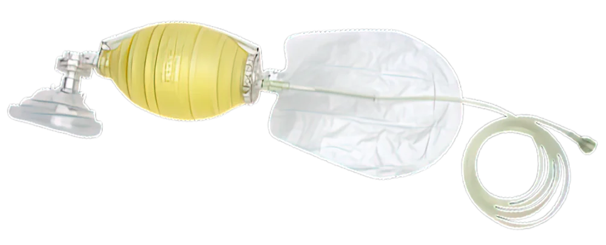

--- 
title: "First Aid Notes"
author: "PGS"
date: "2025-03-03"
header-includes:
  - \usepackage[default]{sourcesanspro}
  - \usepackage[T1]{fontenc}
  - \usepackage{geometry}
  - \geometry{top=1.5cm,bottom=2cm,lmargin=4cm,rmargin=4cm}
mainfont: SourceSansPro
output:
  html_document:
    toc: true
    toc_depth: '4'
    keep_md: true
    df_print: paged
  pdf_document:
    toc: true
    toc_depth: 4
--- 

# Shock

Any medical condition or injury can lead to shock. Shock is brought on by low circulating blood volume. Patient will have lowered blood pressure.

**Signs and symptoms**

- *Initial signs*

  - pale face, lips or fingernails
  - feeling faint or dizzy
  - cool, moist, sweaty skin
  - nausea
  - anxiety

- *Severe shock:*

  - feeling agitated
  - feeling thirsty
  - weak, rapid pulse
  - shallow, fast breathing
  - capillary refill more than 2 sec
  - blue face, earlobes, lips or fingernails (patient is very sick!)
  - decreasing level of consciousness

**Treatment**

- DRSABCD
- Help the patient lie down. Do not raise their legs.
- Reassure them.
- Manage severe bleeding, if any, then other injuries.
- Loosen tight clothing.
- Keep them warm using a blanket.
- Give them small amounts of cool water (if they're conscious, don't have abdominal injuries and won't need an operation soon).
- If they have difficulty breathing, put them in the recovery position.

 

# Heat-induced illness

The aim is to cool down and rehydrate the patient.

*If they don't improve within 10 minutes, call an ambulance.*

 

**Signs and symptoms**

- patient is hot, breathless and sweaty (or dry - worse!)
- they can't continue their activity - they feel too weak
- high body temperature
- feeling faint or dizzy
- nausea, vomiting or diarrhoea
- pale skin and signs of shock setting in
- weak, rapid pulse
- feeling unsteady on their feet
- decreasing level of consciousness

**Treatment**

- Help patient to lie down in a cool, shaded area.
- Remove as much of their clothing as possible.
- Soak them with water.
- Apply ice packs to neck, armpits, groin.
- Fan them continuously.
- Keep spraying them with water or wiping them with a wet cloth.

 

# Swelling and cramps

Hot conditions may result in the body becoming temporarily overheated. This can lead to heat-induced swelling of hands or feet.

Losing too much water and salt through sweating can cause heat cramps, especially in the legs and abdomen.

**Treatment**

*Swelling*

- Raise the affected limb.
- Get the patient to exercise it.
- Keep them cool.

*Cramps*

- Get the patient to stop and rest.
- Gently stretch the muscle that's affected.
- Massage the muscle if it helps reduce pain.
- Apply a cold pack.
- Get the patient to drink some water.

 

# Wounds and Dressings

## Wound types

<table class="table" style="color: black; width: auto !important; ">
 <thead>
  <tr>
   <th style="text-align:left;"> Type </th>
   <th style="text-align:left;"> Description </th>
   <th style="text-align:left;"> Cause </th>
  </tr>
 </thead>
<tbody>
  <tr>
   <td style="text-align:left;"> Bruise </td>
   <td style="text-align:left;width: 20em; "> Visible discolouration on skin, with pain and swelling </td>
   <td style="text-align:left;width: 10em; "> Blow from something blunt </td>
  </tr>
  <tr>
   <td style="text-align:left;"> Incision or cut </td>
   <td style="text-align:left;width: 20em; "> Straight cut with edges that come together </td>
   <td style="text-align:left;width: 10em; "> Sharp object </td>
  </tr>
  <tr>
   <td style="text-align:left;"> Laceration </td>
   <td style="text-align:left;width: 20em; "> Wound with ragged edge, edges may not come together </td>
   <td style="text-align:left;width: 10em; "> Sharp, possibly jagged objects </td>
  </tr>
  <tr>
   <td style="text-align:left;"> Graze </td>
   <td style="text-align:left;width: 20em; "> Superficial scraping of skin, may have dirt in it </td>
   <td style="text-align:left;width: 10em; "> Scraping across a hard surface </td>
  </tr>
  <tr>
   <td style="text-align:left;"> Abrasion </td>
   <td style="text-align:left;width: 20em; "> Superficial or deep (possibly with pits) scraping of skin, may have dirt in it </td>
   <td style="text-align:left;width: 10em; "> Scraping across a hard surface </td>
  </tr>
  <tr>
   <td style="text-align:left;"> Skin tear </td>
   <td style="text-align:left;width: 20em; "> Wound with ragged edge </td>
   <td style="text-align:left;width: 10em; "> Severe force or thin, fragile skin </td>
  </tr>
</tbody>
</table>

 

## Dressings

Dressings can

- absorb blood and other fluids
- keep a wound clean
- help protect a wound from infection
- protect a wound from bumps and scrapes
- reduce pain

### What dressings to use

*Dry dressings*

- cuts and lacerations
- closed blisters (with no skin loss)
- punctures

*Moist (non-adherent) dressings*

- grazes and abrasions
- open blisters (with skin loss)
- skin tears
- burns

*Adhesive dressings*

- minor wounds

*Combine dressing*

- large or deep wounds

 

# Alcohol and drugs

Users' own reports about their drug use are unreliable!

*Record what they say, treat what you find!*

## Broad groups

### Substances that slow patients down - depressants

Depressants slow down messages travelling between the brain and the body.

**Signs and symptoms**

- reduced pulse rate
- reduced blood pressure
- reduced level of consciousness
- usually also reduced respiration rate and respiration volume
- this general reduction in vital signs leads to reduced movement, resulting in *reduced temperature*

**Treatment**

- Maintain the patient's airway and ventilation (usually with a bag valve mask (BVM) resuscitator - picture below).

**Examples**

\vspace{-0.4cm}

- alcohol
- cannabis
- barbiturates (and other sleeping tablets)
- benzodiazepines (and other tranquilisers)
- narcotics (e.g. heroin)
- GHB (gamma hydroxybutyrate)
- volatile substances (e.g. petrol, thinners)

#### Alcohol - snippets

- Being drunk slows down the brain's ability to trigger a gag reflex, which prevents choking, so a drunk person may inhale vomit into their lungs.
- Keep them as upright as possible - never lay them down. If they can't sit up, put them into the recovery position.
- Alcohol is a diuretic. It also causes the stomach to produce more acid than usual, which may cause stomach ache, diarrhoea or vomiting. Give them an open bottle of water so they can *sip* when they want or rinse out their mouth - don't give them acidic drinks like fruit juice.
- Alcohol can cause a drop in body temperature, so keep them warm if they're cold.
- Don't leave them alone - particularly if they're vomiting. Monitor them.

**Effects of alcohol include:**

\vspace{-0.4cm}

- unsteady on feet
- dizziness
- slurred speech
- blurred vision
- reduced pulse
- reduced blood pressure
- reduced respiration rate and respiration volume
- reduced temperature
- slowed reaction time
- altered state of consciousness
- nausea and vomiting
- increased urination (diuretic effect)

### Substances that speed people up - stimulants

Stimulants speed up messages travelling between the brain and the body.

**Signs and symptoms**

\vspace{-0.4cm}

- increased pulse rate
- increased blood pressure
- increased level of consciousness
- usually also increased respiratory rate and respiratory volume
- this general increase in vital signs leads to increased movement, resulting in *increased temperature*
- sweating
- patient may be confused and unable to answer simple questions

**Treatment**

\vspace{-0.4cm}

- Reduce stimuli affecting the patient (i.e. move them away from loud music to a quiet place with no bright lights) to help *bring their temperature down* into the normal range (reducing stimuli and agitation is always the most effective way to reduce temperature).
- To reduce temperature, you may also need to
  - give them small amounts of water - give them an open bottle and say, "Sip when you need to"
  - remove clothing
  - keep the environment cool
- Stay with them - don't leave them alone - and monitor them.  

**Examples**

\vspace{-0.4cm}

- amphetamines and methamphetamines (crystal meth or ice, which comes in small crystals, is stronger and has more harmful side effects than the powdered form of methamphetamine or speed)
- cocaine
- ecstasy (i.e. MDMA or methylenedioxymethamphetamine - similar structure to methamphetamine (speed))

**Notes**

\vspace{-0.4cm}

- Crystal meth or ice, which comes in small crystals, is stronger and has more harmful side effects than the powdered form of methamphetamine or speed.
- The effect of stimulants is similar to a state of fright. Blood moves to the muscles to prepare for running away, pupils dilate so the person can see better. Maintaining this state of fright requires energy - the body uses up available energy stores (glucose) and *body temperature increases*.
- MDMA affects how the body regulates temperature and the body may not respond to warning signals from the brain about it overheating, so the person may not realise their body temperature is becoming too high.

### Other types of drug

- **Dissociative drugs**

  - ketamine
  
    - makes people feel separated from their body or environment, producing symptoms such as:
    - feeling relaxed
    - hallucinations
    - confusion and clumsiness
    - slurred speech and blurred vision
    - increased heart rate and blood pressure
    - vomiting

 

# Heart conditions and chest pain

First, some terminology ...

**Angina (or ischaemic chest pain)**

\vspace{-0.4cm}

- temporary pain or discomfort in the chest usually brought on by exercise or emotional stress because the coronary arteries are too narrow to supply the extra oxygenated blood required by the increased stress

**Chronic heart failure**

\vspace{-0.4cm}

- an ongoing condition, where the heart muscle is weak and cannot pump normally, often because of age, chronic heart disease or a previous heart attack

**Heart attack**

\vspace{-0.4cm}

- occurs when there's a blockage in an artery supplying blood to some part of the heart, preventing blood from reaching the heart muscle beyond the blockage and leading to damage to the heart muscle
- symptoms can appear suddenly but more often start slowly and persist for hours, days or weeks
- the heart usually keeps pumping during a heart attack
- heart attack *can* bring on cardiac arrest

**Cardiac arrest**

\vspace{-0.4cm}

- an electrical malfunction of the heart that causes the ventricles (large pumping chambers) to quiver or "fibrillate" erratically so that the heart cannot pump blood around the body effectively
- when pumping is disrupted, the heart cannot supply blood to the brain, lungs or other organs and the patient loses consciousness and has no pulse
- there is often no warning or symptoms before the patient collapses

*Note the difference between heart attack and cardiac arrest.*

 

\vspace{0.2cm}

**NBB**

\vspace{-0.4cm}

- If chest pain comes on quickly or is severe, it's likely to be a heart attack. Call 000.
- If the patient has angina tablets, it's likely to be angina. Help patient take their angina tablets.

## Chronic heart failure

**Signs and symptoms**

\vspace{-0.4cm}

- general tiredness
- breathlessness when exercising or lying down
- coughing and wheezing
- swollen feet, ankles, legs and abdomen

**Treatment**

\vspace{-0.4cm}

- Unconscious patient
  - DRSABCD
  - call 000

- Conscious patient
  - help patient sit or lie in a comfortable position and reassure them
  - loosen any tight clothing
  - if the patient becomes breathless or collapses, follow DRSABCD and call 000
  
 
## Angina

- angina is usually relieved by rest and angina medication
- most patients with angina are aware of it and have angina medication

**Signs and symptoms**

\vspace{-0.4cm}

- discomfort or tight or squeezing pain in the chest (usually in the centre)
- pain may be mild to severe
- pain may spread from chest to jaw, neck, back, one or both shoulders, arms or hands **or** be in any of those other places rather than in the chest
- shortness of breath

*If the patient has the above symptoms and they aren't relieved by angina medication, treat the patient as for a heart attack.*

**Treatment**

\vspace{-0.4cm}

- ask patient to stop what they're doing and rest
- help them sit or lie in a comfortable position and reassure them
- loosen any tight clothing
- ask them to describe their symptoms
- ask if these signs or symptoms have happened before
  - if so, ask if they have any medication for them
- if rest does not relieve symptoms
  - help them take their angina medication
  - if angina medication has not relieved symptoms after 5 minutes, get them to take another dose
- if symptoms are severe or have not been relieved after 10 minutes, call 000
- operator at 000 may recommend giving patient 300 mg aspirin, if patient can tolerate aspirin
- stay with the patient - do not drive them to hospital, in case you need to do CPR
- if symptoms are relieved quickly, advise them to see a doctor

## Heart attack

- Warning signs and symptoms vary

- Symptoms can start suddenly or develop gradually

- People can have one or a combination of symptoms

**Signs and symptoms**

\vspace{-0.4cm}

- discomfort or pain in the centre of the chest

  - this may start suddenly or build up slowly over several minutes
  - the quality might be tightness, heaviness or squeezing
  - it might be mild to severe
  - it could spread to the jaw, throat, neck, back and one or both shoulders, arms and hands
  
*Atypical signs and symptoms*

- pain might not be tight or squeezing

- patient may also

  - be short of breath
  - have choking feeling in throat
  - feel nauseous
  - feel dizzy
  - have a cold sweat
  
- women may have minimal symptoms (40 % of women have no chest pain), as may elderly people or diabetics

- these minimal symptoms may only be

  - shortness of breath
  - jaw or arm pain
  - nausea

**Treatment**

\vspace{-0.4cm}

- Unconscious patient
  - DRSABCD
  - call 000
  - prepare for giving CPR
  
- Conscious patient
  - ask patient to stop what they're doing and rest
  - help them sit or lie in a comfortable position and reassure them
  - loosen any tight clothing
  - get an AED as a precaution
  - ask them to describe their symptoms
  - ask if these signs or symptoms have happened before
    - if so, ask if they have any medication for them
    - if they do have medication (i.e. for episodes of chest pain), help them take it
  - if symptoms are severe, get worse quickly or last for more than 10 minutes, call 000
  - *the highest priority for someone having a heart attack is to get them to hospital*
  - operator at 000 may recommend giving patient 300 mg aspirin, if patient can tolerate aspirin
  - stay with the patient - do not drive them to hospital, in case you need to do CPR
  

## Cardiac arrest

*The only effective treatment for cardiac arrest outside a hospital is to use an automated external defibrillator (AED).*

**Signs and symptoms**

\vspace{-0.4cm}

- sudden collapse
- patient unresponsive
- patient not breathing

**Treatment**

\vspace{-0.4cm}

- DRSABCD
- Call 000
- Start CPR
- Get a defibrillator and use it if the patient is unconscious and not breathing normally
- Continue CPR till the ambulance arrives
- Do not remove the defibrillator pads, if the defibrillator has been used
- *You cannot harm a patient by connecting a defibrillator because the machine will work out if a shock is needed or not*

 

# Oxygen

## Masks

There's a good video (with transcript) on masks in my "first aid resources" folder.

**Note on terminology** *Oxygenation* - putting an oxygen mask on someone's face. *Ventilation* is taking or moving air into the lungs, which then move upwards and outwards, and then the body using oxygen and excreting carbon dioxide.

 

# Clinical assessment

There are four components of clinical assessment:

1. Primary assessment - DRSABCD

2. Secondary assessment - head-to-toe examination

3. Vital signs (measure what is appropriate)
  - level of consciousness
  - pulse - rate, strength and quality
  - respiration - rate, strength and quality
  - skin colour and texture
  - temperature
  - blood pressure
  - SpO~2~ (blood oxygen saturation)
  - capillary refill time
  - pupil reactions (PERL - **p**upils **e**qual and **r**espond to **l**ight - Are they equal and how do they respond to light?)
  - BLG - blood glucose level
  
4. Patient history - SAMPLE
  - **S** - signs and symptoms
  - **A** - allergies
  - **M** - medication (regular and any within last 24 hours)
  - **P** - past medical history
  - **L** - last time they ate or drank
  - **E** - events leading up to the current incident
  

 

# Glossary

**COPD** - chronic obstructive pulmonary disease (chronic inflammatory lung disease that inflames and narrows the airways; usually caused by long-term exposure to dust or cigarette smoke; also called emphysema or chronic bronchitis)

 

# Rough notes

## Assessment

**Conscious patient and medical problem**

*Introduction and consent*

- Hello. My name's Peter. I'm a first aider.
    - Do you need help? How can I help you?

*Initial history*

- What happened?
- When did it happen?
- How did it happen?
- Have you got any pain? Where does it hurt?
- Can you take a deep breath?

*Initial impression*

- Note patient's reaction to your greeting.
- Note their response.
- Note their posture.
- Note any discomfort or distress.

*Primary assessment (including some vital signs)*

(DRS)ABCD

- Airway
- Breathing - rate, rhythm, quality, SpO~2~
- Circulation - pulse (rate, rhythm, quality), perfusion, blood pressure
- Dysfunction

*Vital signs (as appropriate)*

- level of consciousness
- pulse - rate, strength and quality
- respiration - rate, strength and quality
- skin colour and texture
- temperature
- blood pressure
- SpO~2~ (blood oxygen saturation)
- capillary refill time
- pupil reactions (PERL - **p**upils **e**qual and **r**espond to **l**ight - Are they equal and how do they respond to light?)
- BLG - blood glucose level

*Secondary assessment*

- Head-to-toe examination or focussed examination

*History*

For a medical problem, history of current complaint

- What is the complaint?
- History - OPQRST
  - **O** - onset
    - Did it start gradually or suddenly?
    - What were you doing when it started - exercising, eating, drinking?
  - **P** - provocation and palliation
    - What makes it worse?
    - What makes it better?
    - What brought it on?
  - **Q** - quality
    - What does it feel like? (sharp, dull, throbbing, crushing ...)
    - *Let the patient use their own words to describe it.*
  - **R** - region and radiation
    - Where did it start? Has it moved? Where is it?
    - Is it localised or diffuse? (Get patient to point to location.)
    - Does it stay in one place?
    - Is it in more than one place? Does it move to other places?
  - **S** - severity and associated symptoms
    - How bad is it? (If pain, score it between 0 and 10)
    - Are there any associated symptoms? (e.g. nausea, dizziness ...)
  - **T** - time
    - When did it start?
    - How long did it last?
    - Is it constant or does it come and go?
     
    

SAMPLE

- **S** - signs and symptoms
- **A** - allergies
- **M** - medication (regular and any within last 24 hours)
- **P** - past medical history
- **L** - last time they ate or drank
- **E** - events leading up to the current incident

